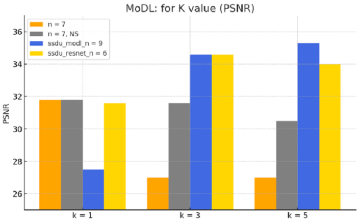

Introduction to the Project:

(1) Generating the appropriate input data from multi-coil brain fastmri MRI k-space source data for model processing.
(2) Evaluating the MoDL framework, a PyTorch-implemented Model-Based Deep Learning Architecture for Inverse Problems.
Assessing the Varnet framework, another PyTorch implementation aimed at Learning a Variational Network for the Reconstruction of Accelerated MRI Data.
(3) Transforming neural networks for self-supervised learning and reconstruction without fully sampled reference data, implemented in TensorFlow, into a PyTorch implementation, furthermore, evaluating the SSDU framework.

Conducting comprehensive evaluations that include:
(a) Variations in the number of unrolled-block in models.
(b) The use of different numbers of convolutional layers in RestNet or encoder-decoder layer configurations in Unet.
(c) Implementation of the SSDU concept with CNN-based and ResNet-based models.
(d) Substituting traditional Unet or ResNet structures with a Vision Transformer architecture.
(e) The performance of models under 4x, 8x, and 12x acceleration masks.

# MoDL

Official code: https://github.com/hkaggarwal/modl





## Reference paper

MoDL: Model Based Deep Learning Architecture for Inverse Problems  by H.K. Aggarwal, M.P Mani, and Mathews Jacob in IEEE Transactions on Medical Imaging,  2018 

Link: https://arxiv.org/abs/1712.02862

IEEE Xplore: https://ieeexplore.ieee.org/document/8434321/

## Dataset

The multi-coil brain fastmri dataset used in this project is different from the one used in the original paper.

**Link** : https://fastmri.med.nyu.edu/

## Configuration file

The configuration files are in `config` folder. 

## Train

You can change the configuration file for training by modifying the `train.sh` file.

```
scripts/train.sh
```

## Test

You can change the configuration file for testing by modifying the `test.sh` file.

```
scripts/test.sh
```

# Varnet


## Reference paper

Learning a Variational Network for Reconstruction of Accelerated MRI Data by Kerstin Hammernik, Teresa Klatzer, Erich Kobler, Michael P. Recht, Daniel K. Sodickson, Thomas Pock, Florian Knoll in Magnetic Resonance in Medicine, 2018

## Dataset, Configuration file, Train ,Test

The same path as described in MoDL

# SSDU

Official code:  https://github.com/byaman14/SSDU (TensorFlow)


## Reference paper

Self-supervised learning of physics-guided reconstruction neural networks without fully sampled reference data by Burhaneddin Yaman, Seyed Amir Hossein Hosseini, Steen Moeller, Jutta Ellermann, Kâmil Uğurbil, Mehmet Akçakaya, 2020

## Dataset, Configuration file, Train ,Test

The same path as described in MoDL

# Comparison tables and trainable parameter counts


# Recontrcucted images


